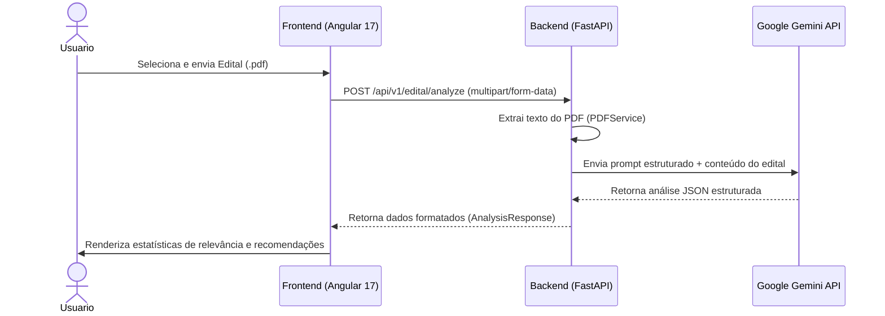

# 📐 Documento de Arquitetura - AprovAI

Este documento descreve os conceitos arquiteturais, padrões de desenvolvimento e a organização física e lógica do projeto **AprovAI**.

---

## 🏛️ Visão Geral do Sistema

O **AprovAI** segue uma arquitetura baseada em micro-camadas descentralizadas (Monorepo), estruturada para garantir a separação total entre o processamento pesado de IA / regras de negócio no backend e a visualização intuitiva e responsiva no frontend.

---

## 📁 Estrutura de Diretórios

### 1. Backend (FastAPI)
Localizado no diretório `/backend`, o projeto adota uma arquitetura em camadas orientada a domínio (Domain-Driven Layers):

* **`app/main.py`**: Ponto de entrada do servidor ASGI. Registra middlewares, CORS e roteadores.
* **`app/core/`**: Configurações globais e inicialização de dependências transversais (banco de dados, chaves de API).
* **`app/api/`**: Camada de entrega HTTP. Define as rotas (endpoints) e controladores da API, divididos por versão (`v1/`).
* **`app/schemas/`**: Schemas de validação Pydantic (Data Transfer Objects - DTOs) que garantem tipagem de entrada e saída.
* **`app/models/`**: Definição das tabelas do banco de dados (ORM SQLAlchemy).
* **`app/services/`**: Lógica de negócios central, integrações com APIs externas (Google Gemini) e processamento de arquivos (PDF).

### 2. Frontend (Angular 17+)
Localizado no diretório `/frontend`, o projeto adota o padrão de componentes **Standalone** (sem NgModules) e organização modular por funcionalidades:

* **`src/app/core/`**: Serviços globais do sistema, como interceptores HTTP, guards de rota e serviços de conexão direta com endpoints do backend.
* **`src/app/shared/`**: Componentes e utilitários compartilhados e reutilizáveis (botões, spinners, modais genéricos).
* **`src/app/features/`**: Módulos de tela por funcionalidade do usuário (ex: `dashboard/` com visualização de estatísticas).

---

## 💾 Banco de Dados

* **Desenvolvimento**: O projeto está preparado para utilizar **PostgreSQL** através do `docker-compose.yml` ou cair automaticamente para **SQLite** local (`sqlite.db`) caso o container de banco de dados não esteja disponível.
* **Produção**: Banco de dados relacional (PostgreSQL na Azure).
* **Camada ORM**: SQLAlchemy 2.0 com consultas tipadas e sessões gerenciadas via Injeção de Dependência no FastAPI (`get_db`).

---

## 🤖 Integração com IA (Google Gemini)

O serviço `GeminiService` abstrai o envio de prompts estruturados para a IA.
* O prompt instrui a IA a retornar dados estritamente em formato **JSON**.
* Se o serviço detectar que a variável `GEMINI_API_KEY` não está configurada com uma chave válida ou está no valor padrão, ele ativa um **modo simulador (fallback mock)** automático. Isso permite que a aplicação seja executada localmente sem erros de inicialização.

---

## 🚀 Como Executar o Projeto Localmente

Consulte o [README.MD](file:///C:/Users/flavi/.gemini/antigravity/worktrees/aprovai/refactor-project-structure-base/README.MD) raiz do projeto para instruções passo a passo sobre a ativação do ambiente de desenvolvimento.
